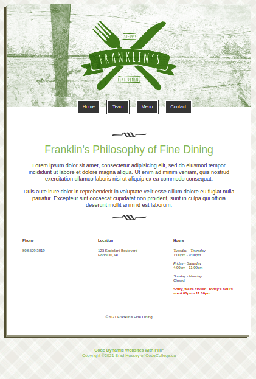

# Restaurant Website

This is a simple restaurant website made using PHP, arrays, loops to learn more cool things we can do with the language. 

THe site has 4 pages, **Home, Team, Menu** and **Contact**.

The members of the team are created using arrays and showed dinamically on the page as well the dishes of the menu.

The header and footer are both used in all pages of the site.

The year on footer is changed in real time using PHP and the hours the restaurant is opened or closed are shown dinamically.

Feel free to use this code wherever you'd like and have fun!

Message me if you want to my friend!

Oooops! I almost forgot! =) If you want to take this course, go to the Udemy Classes too, you can learn so much new and cool stuff right there =)

[Udemy Classes](https://www.udemy.com/course/code-dynamic-websites/learn/lecture/1297848#overview)

  
  
  
  

